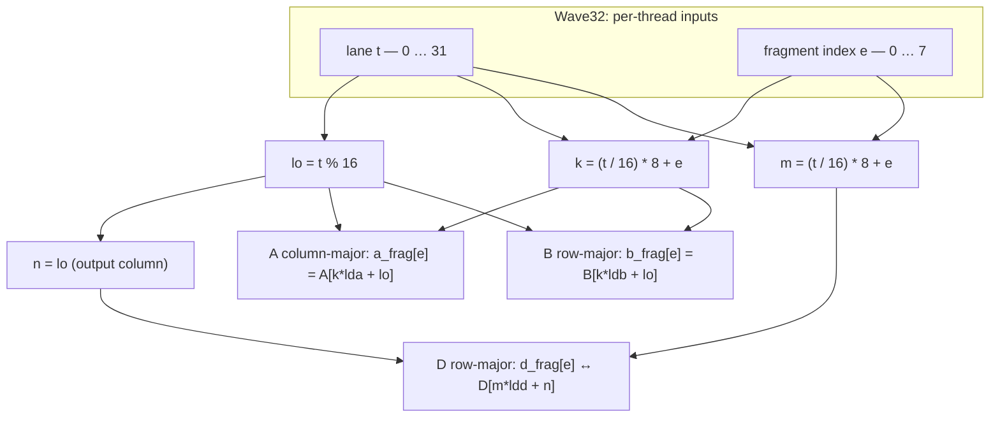

# Wave Matrix Multiply-Accumulate (WMMA) Programming on AMD RDNA 3 and RDNA 4 GPUs

## Overview

AMD's RDNA 3 (GFX11) architecture introduced Wave Matrix Multiply-Accumulate (WMMA) — a hardware-accelerated matrix multiplication instruction set targeting AI and compute workloads. RDNA 4 (GFX12) takes this further by doubling throughput, simplifying the register layout, and adding new data types including FP8 and structured sparsity support.

This article walks through how WMMA works, how to write HIP kernels using WMMA compiler intrinsics, and what you need to change when moving from RDNA 3 to RDNA 4.

> Note: WMMA is a consumer GPU analog to the MFMA instructions found on AMD's datacenter CDNA architecture (MI-series accelerators). While both perform the same D = A × B + C matrix fused multiply-add, the intrinsic names, tile sizes, and register conventions differ significantly between the two families.

---

## Background: What Is WMMA?

WMMA stands for Wave Matrix Multiply-Accumulate. It computes:

```
D = A × B + C
```

where A, B, C, and D are small 2D matrix tiles, and the computation is performed cooperatively by all lanes in a wavefront simultaneously. Unlike regular GPU arithmetic where each thread independently processes scalar or vector data, a WMMA instruction is a *wavefront-level operation* — the entire wavefront works together to produce a single matrix output tile.

This cooperative model lets the hardware optimize data reuse, schedule operand fetches in parallel with math, and achieve peak arithmetic throughput, very similar to NVIDIA's Tensor Core approach.

### GEMM Notation

The tile operation follows the GEMM convention M×N×K:

| Matrix | Shape | Role |
|--------|-------|------|
| A      | M × K | Left operand |
| B      | K × N | Right operand |
| C / D  | M × N | Accumulator input / output |

On both RDNA 3 and RDNA 4, only 16×16 tile sizes are supported, meaning M = N = K = 16 for all WMMA instructions. Larger matrices must be decomposed into 16×16 sub-tiles.

### Memory Layout Conventions

| Matrix | Layout |
|--------|--------|
| A      | Column-major |
| B      | Row-major |
| C / D  | Row-major |

---

## RDNA 3 (GFX11) WMMA

### Supported Data Types

RDNA 3 supports the following WMMA type combinations:

| Input (A, B) | Accumulator (C, D) | Intrinsic Suffix |
|--------------|--------------------|------------------|
| FP16         | FP16               | `f16_16x16x16_f16` |
| FP16         | FP32               | `f32_16x16x16_f16` |
| BF16         | FP32               | `f32_16x16x16_bf16` |
| BF16         | BF16               | `bf16_16x16x16_bf16` |
| INT8         | INT32              | `i32_16x16x16_iu8` |
| INT4         | INT32              | `i32_16x16x16_iu4` |

### Wavefront Mode: Wave32 vs Wave64

RDNA 3 WMMA can be issued in Wave32 or Wave64 mode (`*_w32` vs `*_w64` intrinsics). For FP16/BF16 inputs, each lane’s `A_frag` and `B_frag` each hold 16 half-precision elements packed into VGPRs. `C_frag` and `D_frag` widths per lane depend on accumulator element type and wave mode—for example, FP32 accumulation uses 8 VGPRs per lane in Wave32 and 4 in Wave64. Operand packing into VGPRs depends on datatype, and `A`/`B` lane replication rules also depend on wave mode.

#### `A_frag` / `B_frag` per lane (identical in Wave32 and Wave64)

| A, B format | VGPRs / lane | Packing in each 32-bit VGPR | Input elements / fragment |
|-------------|-------------|----------------------------|---------------------------|
| FP16 / BF16 | 8 | 2× FP16 or BF16 | 16 |
| INT8 (`iu8`) | 4 | 4× packed `iu8` | 16 bytes — Composable Kernel uses `int8x16_t` and `bit_cast<int32x4_t>(…)` at the `__builtin_amdgcn_wmma_i32_16x16x16_iu8_*` call ([Wave32 `Run`](https://github.com/ROCm/composable_kernel/blob/develop/include/ck/utility/amd_wmma.hpp#L127-L137), [Wave64 `Run`](https://github.com/ROCm/composable_kernel/blob/develop/include/ck/utility/amd_wmma.hpp#L247-L257)) |
| INT4 (`iu4`) | 2 | 8× packed `iu4` | 16 4-bit operands |

#### Wave mode: intrinsics, `C`/`D` VGPRs, and `A`/`B` operand replication

| | Wave32 (32 threads) | Wave64 (64 threads) |
|---|-------------------------|-------------------------|
| Intrinsics | `__builtin_amdgcn_wmma_*_…_w32` | `__builtin_amdgcn_wmma_*_…_w64` |
| `C_frag` / `D_frag` VGPRs / lane | 8 | 4 |
| Operand replication | `A`/`B` the same on lanes *i* and *i*+16 | `A`/`B` on lanes 0–15 repeated on 32–47 and 48–63 |

#### Choosing between Wave32 and Wave64

Wave32 is the usual default in RDNA 3 samples and compilers; use `_w32` vs `_w64` to match your kernel’s wave mode and the accumulator store/load pattern you implement for 8 vs 4 C/D VGPRs per lane.

### RDNA 3 Register Layout

In Wave32 FP16 WMMA there are 32 threads, but A and B only need 16 different operand setups; each setup is duplicated on lanes *i* and *i*+16 (same registers on both). Number those setups t = 0…15: t is one row index into the A tile and one column index into the B tile, and you use the same t for both.

With A column-major (`A[m,k]` at `k*16+m`) and B row-major (`B[k,n]` at `k*16+n`), AMD GPUOpen and Composable Kernel tests use:

- `a_frag[k]` = A[t,k] for k = 0…15 — row t of the A tile.
- `b_frag[k]` = B[k,t] for k = 0…15 — column t of the B tile.

Each thread packs 16 FP16 into 8 VGPRs (AMD ISA documentation shows the mapping). Under this layout, load one row of A and one column of B as in the bullets above—not a full A column with a full B row—or the GPU output will usually not match a CPU reference.

FP32 C/D: each thread owns 8 floats in one output column (`lane` = column); half-wave 0 writes even rows, half-wave 1 odd rows, using row-major `D[row*16+col]`. That is 16 columns × two half-waves = 32 threads. The kernels below give the exact indices; Composable Kernel WMMA tests use the same layout.

This A/B replication quirk is eliminated on RDNA 4 — a key improvement discussed below.

### Intrinsic Syntax

FP32 accumulator (e.g. `f32_16x16x16_f16`, `f32_16x16x16_bf16`): Clang expects three arguments — no `OPSEL`:

```c
D_frag = __builtin_amdgcn_wmma_f32_16x16x16_<AB_type>_w<32|64>(
    A_frag, B_frag, C_frag);
```

FP16 / BF16 accumulator (e.g. `f16_16x16x16_f16`): a fourth `OPSEL` argument selects low vs high 16 bits in packed result VGPRs (`false` / `true`).

```c
D_frag = __builtin_amdgcn_wmma_f16_16x16x16_f16_w<32|64>(
    A_frag, B_frag, C_frag, OPSEL);
```

Integer WMMA variants take `neg_a` / `neg_b` / `clamp` and packed operands. `i32_16x16x16_iu8` uses `int32x4` (`__builtin_bit_cast` from 16×`int8`; Composable Kernel [`Run`](https://github.com/ROCm/composable_kernel/blob/develop/include/ck/utility/amd_wmma.hpp#L127-L137)). `i32_16x16x16_iu4` uses `int32x2` (16 int4 nibbles in two `int32`s; `__builtin_amdgcn_wmma_i32_16x16x16_iu4_w32`). CK uses `neg_a` and `neg_b` both `true` for Wave32 iu8; iu4 matches that in [`builtin_wmma_naive_selector` (int4 path)](https://github.com/ROCm/composable_kernel/blob/develop/test/wmma_op/wmma_op_util.hpp#L84-L96) when built with `CK_EXPERIMENTAL_BIT_INT_EXTENSION_INT4`. Operand gather for both follows the [`matmul`](https://github.com/ROCm/composable_kernel/blob/develop/test/wmma_op/wmma_op_util.hpp#L98-L192) kernel, not FP16-style direct global loads. Confirm parameter order with your ROCm Clang builtin declarations.

### Example: FP16 Input, FP32 Output (Wave32, RDNA 3)

Below is a complete, self-contained HIP program: a 16×16×16 GEMM with FP16 inputs and FP32 accumulators using RDNA 3 WMMA intrinsics, plus a host CPU reference (`cpu_gemm_16x16_ref`) that recomputes `D = A×B + C` in higher precision so you can print max absolute error versus the GPU result.

Compile and run (requires ROCm ≥ 5.4 and an RDNA 3 GPU). Run the following from the repository root (the parent of `samples/`):

```bash
hipcc --offload-arch=gfx1100 samples/wmma_rdna3_fp16.cpp -o wmma_rdna3_fp16
./wmma_rdna3_fp16
```

Example output (values depend on inputs; error should stay small, e.g. on the order of `1e-3`…`1e-2` for this ramp data):

```
CPU ref D[0][0] = ..., GPU D[0][0] = ...
Max abs error (CPU vs GPU): ...
```

### Example: INT8 input, INT32 output (Wave32, RDNA 3)

`i32_16x16x16_iu8` does not use the same direct global loads as `f32_16x16x16_f16`. Match Composable Kernel’s WMMA op test: A row-major M×K, B column-major K×N, the shared-memory swizzle in [`matmul`](https://github.com/ROCm/composable_kernel/blob/develop/test/wmma_op/wmma_op_util.hpp#L98-L192), then `__builtin_amdgcn_wmma_i32_16x16x16_iu8_w32` with `neg_a` and `neg_b` both `true` (as in [`builtin_wmma_naive_selector<int8x16_t,…>`](https://github.com/ROCm/composable_kernel/blob/develop/test/wmma_op/wmma_op_util.hpp#L72-L82)). C/D use the same `lane` / `wave2` pattern as the FP32 accumulator example. Host reference: `int64_t` multiply-add, `int32_t` result.

Source file: `samples/wmma_rdna3_iu8.cpp`.

```cpp

```

```bash
hipcc --offload-arch=gfx1100 -std=c++20 samples/wmma_rdna3_iu8.cpp -o wmma_rdna3_iu8
./wmma_rdna3_iu8
```

With the sample data above, the max absolute difference should be `0` if the GPU path matches the integer reference.

### Example: INT4 input, INT32 output (Wave32, RDNA 3)

Same shared-memory operand path as `samples/wmma_rdna3_iu8.cpp`. Matrices are stored as `int8_t` with each value in the signed int4 range `[-8, 7]` (low four bits matter for packing). Each lane’s `int8x16` fragment is packed into `int32x2` before `__builtin_amdgcn_wmma_i32_16x16x16_iu4_w32`. If your hardware disagrees with the nibble order in `pack_iu4_x16`, adjust packing to match your Clang/ISA reference.

Source file: `samples/wmma_rdna3_iu4.cpp`.


```bash
hipcc --offload-arch=gfx1100 -std=c++20 samples/wmma_rdna3_iu4.cpp -o wmma_rdna3_iu4
./wmma_rdna3_iu4
```

With the sample data above, the max absolute difference should be `0` if the GPU path matches the integer reference and the nibble packing matches the hardware.

### Example: FP16 input, FP16 / BF16 accumulators (Wave32, RDNA 3)

The program above keeps C and D as FP32 tiles. RDNA 3 also exposes WMMA variants with packed FP16 or BF16 accumulators. Those intrinsics take a fourth argument `OPSEL`: `false` selects the lower 16 bits of each 32-bit VGPR slot for the FP16/BF16 matrix values, `true` the upper half ([GPUOpen — WMMA on RDNA 3](https://gpuopen.com/learn/wmma_on_rdna3)).

A/B gathers match the FP32-accum example (A column-major row `m = lane`, B row-major column `n = lane`). C/D use the same 8 logical outputs per lane as before; with `OPSEL == false`, place each matrix element in `c_frag[i*2]` / read `d_frag[i*2]`, and store to `D[(i*2 + threadIdx.x/16)*16 + lane]`.

The host CPU path uses sequential FP16 rounding for the half case (closer to f16 WMMA than a pure FP32 reference). For BF16, buffers are `uint16_t` BF16 bits on the host; the device kernel uses `__bf16` (requires a recent ROCm HIP-Clang). Hardware BF16 accumulation order can differ from a scalar float host loop — expect a looser float-space error than FP16.

```bash
hipcc --offload-arch=gfx1100 -O2 samples/wmma_rdna3_f16_bf16_acc.cpp -o wmma_rdna3_f16_bf16_acc
./wmma_rdna3_f16_bf16_acc
```

---

## RDNA 4 (GFX12) WMMA

RDNA 4 introduces 3rd-generation Matrix Cores with several improvements:

| Metric | RDNA 3 | RDNA 4 |
|--------|--------|--------|
| FP16 / BF16 FLOPS per clock per CU | 256 | 512 (2×, per AMD arch disclosures; verify per SKU) |
| INT8 FLOPS per clock per CU | 256 | 1024 (4×, per AMD arch disclosures; verify per SKU) |
| FP8 support | No | Yes (E4M3 / E5M2) |
| Structured sparsity | No | Yes (4:2, via SWMMAC) |
| Register duplication | Yes (A/B lanes 16–31) | Eliminated |
| VGPR count per lane (FP16, Wave32) | 16×`half` logical (8 VGPR pairs) | 8×`half` as `half8_t` (4 VGPR pairs); no mirror lanes |

> Breaking Change: RDNA 4 WMMA intrinsics are not backward compatible with RDNA 3 intrinsics. All RDNA 4 intrinsics carry a `_gfx12` suffix and use a different operand and accumulator lane map (see below). LLVM also exposes `_w64_gfx12` variants for Wave64 mode; the examples here use Wave32.

### Register layout: no lane mirroring (RDNA 4)

The main improvement over RDNA 3 is removing redundant A/B replication: on GFX11, lanes 16–31 carried the same A/B operands as lanes 0–15. On GFX12, each lane holds eight unique FP16 values (`half8_t`) with no mirror lanes.

```
RDNA 3 (Wave32) — A/B operands (conceptual):
  Lanes  0–15: primary data
  Lanes 16–31: DUPLICATE of lanes 0–15   ← wasted fetch / register traffic

RDNA 4 (Wave32) — A/B operands:
  Lanes 0–31: eight unique FP16 values per lane (no mirror)
```

Chaining WMMA (e.g. MLP) still needs a layout transform: on gfx12, operand layout for A/B ≠ accumulator layout for D (see formulas below). You normally write D to shared or global memory in row-major form, then reload the next operand with the correct mapping, or use rocWMMA / Composable Kernel. See [ROCm issue #6025](https://github.com/ROCm/ROCm/issues/6025).

### New Data Types in RDNA 4

RDNA 4 adds FP8 and BF8 (brain float 8-bit) WMMA instructions:

| Input (A, B) | Accumulator (C, D) | Intrinsic Suffix (gfx12) |
|--------------|--------------------|--------------------------|
| FP16         | FP16               | `f16_16x16x16_f16_w32_gfx12` |
| BF16         | BF16               | `bf16_16x16x16_bf16_w32_gfx12` |
| FP16         | FP32               | `f32_16x16x16_f16_w32_gfx12` |
| BF16         | FP32               | `f32_16x16x16_bf16_w32_gfx12` |
| FP8 (E4M3)   | FP32               | `f32_16x16x16_fp8_fp8_w32_gfx12` |
| BF8 (E5M2)   | FP32               | `f32_16x16x16_bf8_bf8_w32_gfx12` |
| Mixed FP8/BF8| FP32               | `f32_16x16x16_fp8_bf8_w32_gfx12` |
| INT8         | INT32              | `i32_16x16x16_iu8_w32_gfx12` |
| INT4         | INT32              | `i32_16x16x16_iu4_w32_gfx12` |
| INT4         | INT32              | `i32_16x16x32_iu4_w32_gfx12` (larger K); operand layout — ISA PDF / [Matrix Instruction Calculator](https://github.com/ROCm/amd_matrix_instruction_calculator) |

Additionally, SWMMAC (Sparse Wave Matrix Multiply-Accumulate) instructions exploit 4:2 structured sparsity for a further 2× throughput boost.

### RDNA 4 Intrinsic Syntax

Compared to RDNA 3, gfx12 **drops `OPSEL`** for **packed FP16 and BF16 accumulator** results (e.g. `f16_16x16x16_f16_*`, `bf16_16x16x16_bf16_*`): the output is always densely packed. RDNA 3 **`f32_16x16x16_*`** was already three-argument with no `OPSEL`.

For the **floating-point WMMA** family (FP16 / BF16 / FP8 inputs with FP16, BF16, or FP32 accumulators, and the usual **16×16×16** tile encoded in the name), the Wave32 pattern is:

```c
D_frag = __builtin_amdgcn_wmma_<CD_type>_16x16x16_<AB_type>_w32_gfx12(
    A_frag,   // vector of A tile elements
    B_frag,   // vector of B tile elements
    C_frag    // vector of C (accumulator) elements
);
```

**Integer** WMMA (`iu8`, `iu4`) does **not** use the three-operand float pattern: Clang’s gfx12 builtins take **`neg_a` / `neg_b` / `clamp` (`i1`) and packed A/B** plus the accumulator (**six arguments** in practice — see Clang’s [gfx12 WMMA Wave32 codegen test](https://github.com/llvm/llvm-project/blob/main/clang/test/CodeGenOpenCL/builtins-amdgcn-gfx12-wmma-w32.cl), e.g. `__builtin_amdgcn_wmma_i32_16x16x16_iu8_w32_gfx12`, `…_16x16x16_iu4_…`, `…_16x16x32_iu4_…`). The **numeric triple** in the middle of the name (`16x16x16` vs `16x16x32`, …) encodes the hardware tile shape; map it to matrix dimensions using the **RDNA4 ISA PDF** / [Matrix Instruction Calculator](https://github.com/ROCm/amd_matrix_instruction_calculator).

**FP16 → FP32** on gfx12 Wave32: `__builtin_amdgcn_wmma_f32_16x16x16_f16_w32_gfx12(half8_t, half8_t, float8_t)` — **8** `half` elements per lane for A/B (not 16). With A column-major (`A[k*lda+m]`), B row-major (`B[k*ldb+n]`), D row-major (`D[m*ldd+n]`), lane `t` and `e ∈ [0,8)` (Composable Kernel–style layout):

| Tile | Gather / scatter |
|------|------------------|
| A (`M×K`) | `m = t % 16`, `k = (t/16)*8 + e` → `a_frag[e] = A[k*lda+m]` |
| B (`K×N`) | `n = t % 16`, `k = (t/16)*8 + e` → `b_frag[e] = B[k*ldb+n]` |
| C / D (`M×N`) | `m = (t/16)*8 + e`, `n = t % 16` → `d_frag[e]` ↔ `D[m*ldd+n]` |

The diagram below is **not** a runtime animation; it is a **Mermaid** flowchart (renders on GitHub, many IDEs, and static-site generators). If you only see a code fence, use the table above.



**Pitfall:** `t % 16` is the **N** column of the output tile, not **M** — easy to mis-map when porting from CUDA ([ROCm #6025](https://github.com/ROCm/ROCm/issues/6025)).

### Example 1: FP16 Input, FP32 Output (Wave32, RDNA 4)

This matches the RDNA 3 example (same memory layouts) but uses `half8_t` / `float8_t` operands, the `_gfx12` suffix, no `OPSEL`, and the lane formulas in the table / Mermaid diagram above for loads and stores. `main` again compares against the same CPU reference GEMM and prints max abs error.


Compile and run (requires ROCm ≥ 6.2 and an RDNA 4 GPU, e.g., RX 9070 XT):

```bash
hipcc --offload-arch=gfx1201 samples/wmma_rdna4_fp16.cpp -o wmma_rdna4_fp16
./wmma_rdna4_fp16
```

### Example 2: FP8 Input, FP32 Output (RDNA 4 Only)

FP8 (E4M3) WMMA is exclusive to RDNA 4. For gfx12 Wave32, operands are 8 packed FP8 bytes per lane (`int32x2` bit pattern passed to the builtin, same m/k/n gather as the FP16 example). **`samples/wmma_rdna4_fp8.cpp`** is a complete program: host fills `uint8_t` tiles via **`__hip_fp8_e4m3`** (`hip_fp8.h`, OCP E4M3), runs **`cpu_gemm_fp8_ref`** with `long double` accumulation after **`fp8_storage_to_float`**, launches the kernel with FP32 **`C`**, prints max abs error vs GPU, and exits non‑zero if error exceeds a loose FP8 threshold.

```bash
hipcc --offload-arch=gfx1201 samples/wmma_rdna4_fp8.cpp -o wmma_rdna4_fp8
./wmma_rdna4_fp8
```

### Example 3: Chained WMMA for MLP Inference (RDNA 4)

On gfx12, D’s accumulator layout ≠ B’s operand layout, so you cannot reuse the first WMMA’s register output as the second WMMA’s B fragment without reordering. A small shared-memory staging step (store row-major, reload with the B gather above) is typical. **`samples/mlp_wmma_rdna4.cpp`** implements `output = W2 * relu(W1 * input)` on 16×16 tiles: two `_gfx12` WMMAs, **`relu` in FP32**, hidden tile written to **`__half` shared memory** (matching the second layer’s FP16 B operand), and a host **`cpu_mlp_ref`** that mirrors the same steps (`long double` GEMMs, `relu`, **`__float2half`** before the second multiply). The kernel uses a **fresh zero accumulator** for the second WMMA (`acc1`), not the variable passed to the first WMMA.

```bash
hipcc --offload-arch=gfx1201 samples/mlp_wmma_rdna4.cpp -o mlp_wmma_rdna4
./mlp_wmma_rdna4
```

---

## Using the Higher-Level rocWMMA Library

For applications that don't need to hand-tune intrinsic-level code, AMD provides rocWMMA — a C++ template library with an interface modeled after CUDA's `nvcuda::wmma` API. It handles register layout management automatically and supports both RDNA and CDNA architectures.

**`samples/rocwmma_example.cpp`** is a full HIP program: one 16×16×16 tile with `fragment<matrix_a, …, col_major>`, `fragment<matrix_b, …, row_major>`, FP32 accumulator, **`D = A*B + C`** with a non-zero **`C`** buffer (same layout as `samples/wmma_rdna4_fp16.cpp`), host **`cpu_gemm_16x16_ref`** with `long double` accumulation, and max-abs error printing. The launch queries **`hipGetDeviceProperties` → `warpSize`** so the block matches the device wavefront (**32** on RDNA, **64** on typical CDNA).

**rocWMMA 7.x note:** loading the accumulator from global memory requires an explicit layout on the `load_matrix_sync` overload, e.g. **`load_matrix_sync(c_frag, C, ld, mem_row_major)`** — the older three-argument form is not enough when `c_frag` has no static layout in the type.

```bash
hipcc --offload-arch=native samples/rocwmma_example.cpp -o rocwmma_example
./rocwmma_example
```

---

## Scaling Up: Tiled GEMM Beyond 16×16

Real workloads involve matrices far larger than 16×16. The standard approach is to decompose the problem into a grid of 16×16 tiles and accumulate partial products:

```
for each output tile (bm, bn):
    c_tile = 0
    for each reduction step bk:
        load A_tile = A[bm*16 : (bm+1)*16,  bk*16 : (bk+1)*16]
        load B_tile = B[bk*16 : (bk+1)*16,  bn*16 : (bn+1)*16]
        c_tile += wmma(A_tile, B_tile)
    write D[bm*16 : (bm+1)*16,  bn*16 : (bn+1)*16] = c_tile
```

In HIP, each thread block typically handles one or more output tiles, and each wavefront within the block is assigned exactly one WMMA operation per step.

**`samples/tiled_gemm_rdna4.cpp`** implements **`D = A * B`** for **`M×K`** `__half` **A** (column-major, stride `lda`), **`K×N`** **B** (row-major, `ldb`), **`M×N`** FP32 **D** (row-major, `ldd`), with **`M, N, K` multiples of 16**. Each block covers one 16×16 output tile: **`grid(N/16, M/16)`**, **`block(32)`**. The self-check requires **`max abs error < 1e-3`** vs a **FP32 CPU GEMM** that steps **`K` in chunks of 16** with **`fmaf`** (closer to the WMMA schedule than a single long loop). Test inputs include a small **`DATA_SCALE`** so large sizes (e.g. **1024³**) still satisfy the strict bound. Optional **`M N K`** CLI args; default **32×32×32**.

```bash
hipcc --offload-arch=gfx1201 samples/tiled_gemm_rdna4.cpp -o tiled_gemm_rdna4
./tiled_gemm_rdna4
./tiled_gemm_rdna4 64 48 32
```

---

## Side-by-Side Comparison: RDNA 3 vs RDNA 4

| Feature | RDNA 3 (GFX11) | RDNA 4 (GFX12) |
|---------|---------------|---------------|
| Architecture code | `gfx1100`–`gfx1102` (other GFX11 targets such as `gfx1150`, `gfx1151` also appear in ROCm) | `gfx1200`, `gfx1201` |
| Tile size | **16×16×16** for typical FP / INT8 WMMA | Same for most types; **INT4** on gfx12 also has larger-**K** shapes (e.g. **16×16×32**) — see [RDNA 4 (GFX12) WMMA](#rdna-4-gfx12-wmma) type table / ISA |
| Wavefront mode | Wave32 / Wave64 | Wave32 (examples); `_w64_gfx12` intrinsics also exist |
| FP16/BF16 FLOPS/clock/CU | 256 | 512 (per AMD arch disclosures; verify per SKU) |
| INT8 FLOPS/clock/CU | 256 | 1024 (per AMD arch disclosures; verify per SKU) |
| FP8 support | No | Yes (E4M3, E5M2) |
| Structured sparsity | No | Yes (4:2 SWMMAC) |
| Lane duplication (A/B) | Yes | No |
| Intrinsic suffix | (none) | `_gfx12` |
| `OPSEL` argument | FP16/BF16 accumulator output only (e.g. `f16_16x16x16_f16`); not used for `f32_16x16x16_*` (3-arg) | No |
| Backward compatible | — | No |
| Min ROCm version | ~5.4 (order-of-magnitude; check your ROCm release) | ~6.2+ (gfx12 WMMA / FP8 paths; check release notes) |
| Example intrinsic | `__builtin_amdgcn_wmma_f32_16x16x16_f16_w32` | `__builtin_amdgcn_wmma_f32_16x16x16_f16_w32_gfx12` |

---

## Choosing the Right Approach

| Use Case | Recommendation |
|----------|---------------|
| Maximum portability across RDNA 3 & 4 | rocWMMA library — handles layout differences automatically |
| Maximum performance, full control | Compiler intrinsics with architecture-specific code paths |
| Prototyping / research | Intrinsics with `#ifdef __gfx12__` / `#ifdef __gfx11__` guards |
| CUDA code porting | rocWMMA (API mirrors `nvcuda::wmma`) |

To compile for multiple targets simultaneously:

```bash
# Both RDNA3 and RDNA4 targets in one binary
hipcc --offload-arch=gfx1100 --offload-arch=gfx1201 my_kernel.cpp -o my_kernel
```

To detect the architecture at runtime (useful for choosing the right kernel):

```cpp
hipDeviceProp_t prop;
hipGetDeviceProperties(&prop, 0);
// prop.gcnArchName will be e.g. "gfx1100" or "gfx1201"
bool is_rdna4 = (strncmp(prop.gcnArchName, "gfx12", 5) == 0);
```

---

## Tools and Further Reading

### AMD Matrix Instruction Calculator

The [AMD Matrix Instruction Calculator](https://github.com/ROCm/amd_matrix_instruction_calculator) is an official tool that prints detailed WMMA instruction information for any supported architecture:

```bash
# Show FP16 WMMA details for RDNA3 (gfx1100)
python3 matrix_calculator.py --architecture gfx1100 \
    --instruction v_wmma_f32_16x16x16_f16 --detail-instruction

# Show FP8 WMMA details for RDNA4 (gfx1201)
python3 matrix_calculator.py --architecture gfx1201 \
    --instruction v_wmma_f32_16x16x16_fp8_fp8 --detail-instruction
```

Output includes: opcode, VGPR count, element mapping per lane, and peak throughput estimates.

### ISA Reference Guides

- [RDNA3 ISA Reference Guide (PDF)](https://www.amd.com/content/dam/amd/en/documents/radeon-tech-docs/instruction-set-architectures/rdna3-shader-instruction-set-architecture-feb-2023_0.pdf)
- [RDNA4 ISA Reference Guide (PDF)](https://www.amd.com/content/dam/amd/en/documents/radeon-tech-docs/instruction-set-architectures/rdna4-instruction-set-architecture.pdf)

---

## Summary

WMMA brings hardware matrix acceleration to AMD's consumer GPU line, enabling significant AI and compute performance gains without requiring a datacenter GPU. RDNA 3 introduced the foundation with FP16/BF16/INT8 support; RDNA 4 doubles down with higher throughput, a cleaner operand layout without mirror lanes, and new FP8 data types opening the door to ultra-low-precision inference. Chained WMMA still needs explicit layout transforms unless you use rocWMMA / CK.

When writing WMMA code:

1. RDNA 3: use `__builtin_amdgcn_wmma_*_w32` or `*_w64` intrinsics; account for lane duplication in A/B.
2. RDNA 4: use `__builtin_amdgcn_wmma_*_w32_gfx12` (or `*_w64_gfx12`) with `half8_t` / `float8_t` and the m/k/n lane formulas above for loads and stores; add FP8 / SWMMAC where applicable.
3. Both: consider rocWMMA for portable, maintainable code.

---

## Sources

- [How to accelerate AI applications on RDNA 3 using WMMA — AMD GPUOpen](https://gpuopen.com/learn/wmma_on_rdna3/)
- [Using the Matrix Cores of AMD RDNA 4 architecture GPUs — AMD GPUOpen](https://gpuopen.com/learn/using_matrix_core_amd_rdna4/)
- [Matrix Core Programming on AMD CDNA3 and CDNA4 — AMD ROCm Blog](https://rocm.blogs.amd.com/software-tools-optimization/matrix-cores-cdna/README.html)
- [AMD Matrix Instruction Calculator — GitHub](https://github.com/ROCm/amd_matrix_instruction_calculator)
- [rocWMMA Programming Guide — ROCm Documentation](https://rocm.docs.amd.com/projects/rocWMMA/en/latest/conceptual/programmers-guide.html)
- [RDNA3 ISA Reference Guide — AMD](https://www.amd.com/content/dam/amd/en/documents/radeon-tech-docs/instruction-set-architectures/rdna3-shader-instruction-set-architecture-feb-2023_0.pdf)
- [RDNA4 ISA Reference Guide — AMD](https://www.amd.com/content/dam/amd/en/documents/radeon-tech-docs/instruction-set-architectures/rdna4-instruction-set-architecture.pdf)
- [Examining AMD's RDNA 4 Changes in LLVM — Chips & Cheese](https://chipsandcheese.com/p/examining-amds-rdna-4-changes-in-llvm)
- [WMMA Benefits for ML and General Compute — AMD GPUOpen](https://gpuopen.com/news/wmma_benefits_ml_compute/)
- [ROCm issue #6025 — gfx12 WMMA output / lane mapping discussion](https://github.com/ROCm/ROCm/issues/6025)
