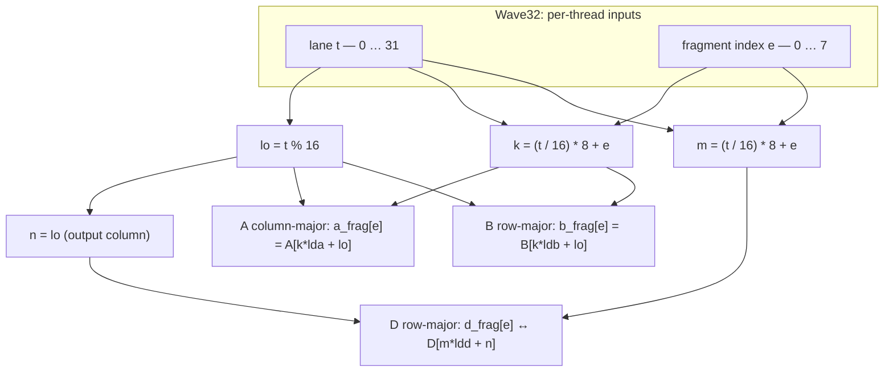

# AMD RDNA 3 与 RDNA 4 GPU 上的 WMMA（波前矩阵乘累加）编程

## 概述

AMD RDNA 3（GFX11）架构引入了 Wave Matrix Multiply-Accumulate（WMMA，波前矩阵乘累加）——一套面向 AI 与高性能计算的硬件加速矩阵乘法指令集。RDNA 4（GFX12）在此基础上将吞吐量翻倍、简化寄存器布局，并新增 FP8 等数据类型及结构化稀疏支持。

本文介绍 WMMA 的工作原理、如何用 WMMA 编译器 intrinsic 编写 HIP kernel，以及从 RDNA 3 迁到 RDNA 4 时需要改动的要点。

> 说明：WMMA 是消费级 GPU 上对应数据中心 CDNA（MI 系列）MFMA 的类似能力。二者都做 D = A × B + C 的矩阵融合乘加，但 intrinsic 名称、分块尺寸与寄存器约定在两代架构间差异很大。

---

## 背景：WMMA 是什么？

WMMA 即 Wave Matrix Multiply-Accumulate（波前矩阵乘累加），计算：

```
D = A × B + C
```

其中 A、B、C、D 均为小型 2D 矩阵分块，由波前中所有 lane 协同完成。与常规 GPU 算术（每线程独立处理标量/向量）不同，WMMA 是*波前级操作*——整个波前协作产生一块矩阵输出。

该模式便于硬件优化数据复用、将取数与计算重叠调度，从而接近峰值算力，思路与 NVIDIA Tensor Core 相近。

### GEMM 记法

分块运算遵循 GEMM 的 M×N×K 约定：

| 矩阵 | 形状 | 作用 |
|------|------|------|
| A | M × K | 左操作数 |
| B | K × N | 右操作数 |
| C / D | M × N | 累加器输入 / 输出 |

在 RDNA 3 与 RDNA 4 上，WMMA 仅支持 16×16 分块，即 M = N = K = 16。更大矩阵需拆成 16×16 子块。

### 内存布局约定

| 矩阵 | 布局 |
|------|------|
| A | 列主序（Column-major） |
| B | 行主序（Row-major） |
| C / D | 行主序（Row-major） |

---

## RDNA 3 (GFX11) WMMA

### 支持的数据类型

RDNA 3 支持的 WMMA 类型组合如下：

| 输入（A、B） | 累加器（C、D） | Intrinsic 后缀 |
|-------------|---------------|----------------|
| FP16 | FP16 | `f16_16x16x16_f16` |
| FP16 | FP32 | `f32_16x16x16_f16` |
| BF16 | FP32 | `f32_16x16x16_bf16` |
| BF16 | BF16 | `bf16_16x16x16_bf16` |
| INT8 | INT32 | `i32_16x16x16_iu8` |
| INT4 | INT32 | `i32_16x16x16_iu4` |

### 波前模式：Wave32 与 Wave64

RDNA 3 的 WMMA 可在 Wave32 或 Wave64 下发出（`*_w32` 与 `*_w64` intrinsic）。对 FP16/BF16 输入，每条 lane 的 `A_frag` 与 `B_frag` 各含 16 个半精度元素（打包在 VGPR 中）。`C_frag` / `D_frag` 每 lane 宽度取决于累加器类型与波前模式——例如 FP32 累加在 Wave32 下每 lane 常为 8 个累加 VGPR，Wave64 下为 4 个。操作数在 VGPR 中的打包随数据类型而变，`A`/`B` 的 lane 复制规则也随波前模式而变。

#### 每条 lane 的 `A_frag` / `B_frag`（Wave32 与 Wave64 相同）

| A、B 格式 | 每 lane VGPR 数 | 每个 32 位 VGPR 内打包 | 每分片输入元素 |
|-----------|----------------|----------------------|---------------|
| FP16 / BF16 | 8 | 2× FP16 或 BF16 | 16 |
| INT8（`iu8`） | 4 | 4× 打包 `iu8` | 16 字节 — Composable Kernel 在调用 `__builtin_amdgcn_wmma_i32_16x16x16_iu8_*` 时使用 `int8x16_t` 与 `bit_cast<int32x4_t>(…)`（[Wave32 `Run`](https://github.com/ROCm/composable_kernel/blob/develop/include/ck/utility/amd_wmma.hpp#L127-L137)、[Wave64 `Run`](https://github.com/ROCm/composable_kernel/blob/develop/include/ck/utility/amd_wmma.hpp#L247-L257)） |
| INT4（`iu4`） | 2 | 8× 打包 `iu4` | 16 个 4 位操作数 |

#### 波前模式：intrinsic、`C`/`D` VGPR、A/B 操作数复制

| | Wave32（32 线程） | Wave64（64 线程） |
|---|------------------|------------------|
| Intrinsic | `__builtin_amdgcn_wmma_*_…_w32` | `__builtin_amdgcn_wmma_*_…_w64` |
| 每 lane `C_frag` / `D_frag` VGPR | 8 | 4 |
| 操作数复制 | `A`/`B` 在 lane *i* 与 *i*+16 相同 | `A`/`B`：lane 0–15 的配置在 32–47、48–63 上重复 |

#### Wave32 与 Wave64 的选择

RDNA 3 示例与编译器侧通常默认 Wave32；选用 `_w32` 或 `_w64` 须与 kernel 波前模式及你为每 lane 8 个或 4 个 C/D VGPR 实现的存取模式一致。

### RDNA 3 寄存器布局

在 Wave32 FP16 WMMA 中有 32 个线程，但 A、B 只需 16 种不同的操作数配置；每种配置在 lane *i* 与 *i*+16 上重复（寄存器相同）。将这 16 种配置编号为 t = 0…15：t 同时是 A 分块的一行下标与 B 分块的一列下标，且 A、B 使用同一个 t。

在 A 为列主序（`A[m,k]` 位于 `k*16+m`）、B 为行主序（`B[k,n]` 位于 `k*16+n`）时，AMD GPUOpen 与 Composable Kernel 测试采用：

- `a_frag[k]` = A[t,k]，k = 0…15 —— A 分块的第 t 行。
- `b_frag[k]` = B[k,t]，k = 0…15 —— B 分块的第 t 列。

每线程将 16 个 FP16 打包进 8 个 VGPR（映射见 AMD ISA 文档）。在此布局下应按上述要点加载 A 的一行与 B 的一列——不要用「整列 A + 整行 B」的常见误解写法，否则 GPU 结果通常与 CPU 参考不一致。

FP32 的 C/D：每线程拥有同一输出列上的 8 个 float（`lane` = 列）；半波 0 写偶数行，半波 1 写奇数行，行主序 `D[row*16+col]`。即 16 列 × 两个半波 = 32 线程。下文示例给出精确下标；Composable Kernel 的 WMMA 测试使用相同布局。

上述 A/B 复制特性在 RDNA 4 上被取消——这是下文要谈的关键改进之一。

### Intrinsic 语法

FP32 累加器（如 `f32_16x16x16_f16`、`f32_16x16x16_bf16`）：Clang 为三参数形式——无 `OPSEL`：

```c
D_frag = __builtin_amdgcn_wmma_f32_16x16x16_<AB_type>_w<32|64>(
    A_frag, B_frag, C_frag);
```

FP16 / BF16 累加器（如 `f16_16x16x16_f16`）：第四个参数 `OPSEL` 选择打包结果 VGPR 中低 16 位还是高 16 位（`false` / `true`）。

```c
D_frag = __builtin_amdgcn_wmma_f16_16x16x16_f16_w<32|64>(
    A_frag, B_frag, C_frag, OPSEL);
```

整数 WMMA 带有 `neg_a` / `neg_b` / `clamp` 及打包操作数。`i32_16x16x16_iu8` 使用 `int32x4`（由 16×`int8` 经 `__builtin_bit_cast`；Composable Kernel [`Run`](https://github.com/ROCm/composable_kernel/blob/develop/include/ck/utility/amd_wmma.hpp#L127-L137)）。`i32_16x16x16_iu4` 使用 `int32x2`（两个 `int32` 承载 16 个 int4 半字节；`__builtin_amdgcn_wmma_i32_16x16x16_iu4_w32`）。CK 在 Wave32 iu8 上令 `neg_a`、`neg_b` 均为 `true`；iu4 在启用 `CK_EXPERIMENTAL_BIT_INT_EXTENSION_INT4` 时与 [`builtin_wmma_naive_selector`（int4 路径）](https://github.com/ROCm/composable_kernel/blob/develop/test/wmma_op/wmma_op_util.hpp#L84-L96) 一致。二者装片均遵循 [`matmul`](https://github.com/ROCm/composable_kernel/blob/develop/test/wmma_op/wmma_op_util.hpp#L98-L192) 内核，而非 FP16 的全局直接取数。参数顺序以当前 ROCm Clang 的 builtin 声明为准。

### 示例：FP16 输入、FP32 输出（Wave32，RDNA 3）

下面是一份完整的 HIP 程序：16×16×16 GEMM，FP16 输入、FP32 累加，使用 RDNA 3 WMMA intrinsic；Host 侧 `cpu_gemm_16x16_ref` 以更高精度重算 `D = A×B + C`，便于打印与 GPU 结果的最大绝对误差。

编译与运行（需要 ROCm ≥ 5.4 与 RDNA 3 GPU）。以下命令在仓库根目录（`samples/` 的上一级）执行：

```bash
hipcc --offload-arch=gfx1100 samples/wmma_rdna3_fp16.cpp -o wmma_rdna3_fp16
./wmma_rdna3_fp16
```

示例输出（数值随输入而变；对本 ramp 数据误差通常较小，约在 `1e-3`…`1e-2` 量级）：

```
CPU ref D[0][0] = ..., GPU D[0][0] = ...
Max abs error (CPU vs GPU): ...
```

### 示例：INT8 输入、INT32 输出（Wave32，RDNA 3）

`i32_16x16x16_iu8` 不使用与 `f32_16x16x16_f16` 相同的全局直接加载。应对齐 Composable Kernel 的 WMMA op 测试：A 为 M×K 行主序，B 为 K×N 列主序，[`matmul`](https://github.com/ROCm/composable_kernel/blob/develop/test/wmma_op/wmma_op_util.hpp#L98-L192) 中的共享内存 swizzle，再调用 `__builtin_amdgcn_wmma_i32_16x16x16_iu8_w32` 且 `neg_a`、`neg_b` 均为 `true`（与 [`builtin_wmma_naive_selector<int8x16_t,…>`](https://github.com/ROCm/composable_kernel/blob/develop/test/wmma_op/wmma_op_util.hpp#L72-L82) 一致）。C/D 使用与 FP32 累加示例相同的 `lane` / `wave2` 模式。Host 参考：`int64_t` 乘加，`int32_t` 结果。

源文件：`samples/wmma_rdna3_iu8.cpp`。

```cpp

```

```bash
hipcc --offload-arch=gfx1100 -std=c++20 samples/wmma_rdna3_iu8.cpp -o wmma_rdna3_iu8
./wmma_rdna3_iu8
```

在示例数据下，若 GPU 路径与整数参考一致，最大绝对差应为 `0`。

### 示例：INT4 输入、INT32 输出（Wave32，RDNA 3）

与 `samples/wmma_rdna3_iu8.cpp` 相同的共享内存操作数路径。矩阵以 `int8_t` 存储，取值在有符号 int4 范围 `[-8, 7]`（低 4 位参与打包）。每 lane 的 `int8x16` 分片在调用 `__builtin_amdgcn_wmma_i32_16x16x16_iu4_w32` 前打包为 `int32x2`。若硬件与 `pack_iu4_x16` 中的半字节顺序不一致，请按 Clang/ISA 参考调整打包。

源文件：`samples/wmma_rdna3_iu4.cpp`。


```bash
hipcc --offload-arch=gfx1100 -std=c++20 samples/wmma_rdna3_iu4.cpp -o wmma_rdna3_iu4
./wmma_rdna3_iu4
```

在示例数据下，若 GPU 路径与整数参考一致且半字节打包与硬件一致，最大绝对差应为 `0`。

### 示例：FP16 输入，FP16 / BF16 累加器（Wave32，RDNA 3）

上文程序中 C、D 为 FP32 分块。RDNA 3 还提供累加器仍为打包 FP16 或 BF16 的 WMMA 变体，对应 intrinsic 带第四个参数 `OPSEL`：`false` 使用每个 32 位 VGPR 槽位的低 16 位表示矩阵元素，`true` 使用高 16 位（见 [GPUOpen — RDNA 3 上的 WMMA](https://gpuopen.com/learn/wmma_on_rdna3)）。

A/B 的 gather 与 FP32 累加示例相同（A 列主序行 `m = lane`，B 行主序列 `n = lane`）。C/D 仍每 lane 8 个逻辑输出；当 `OPSEL == false` 时，将每个矩阵元素放在 `c_frag[i*2]` / 从 `d_frag[i*2]` 读出，并写入 `D[(i*2 + threadIdx.x/16)*16 + lane]`。

Host 侧：half 路径采用按步长回写到 half 的朴素规约（更接近 f16 WMMA）；BF16 在 host 上用 `uint16_t` 存 BF16 位型，device 侧用 `__bf16`（需较新的 ROCm HIP-Clang）。硬件 BF16 累加顺序可能与标量 float 的 host 循环不同——在 float 域误差可能比 FP16 更大。

```bash
hipcc --offload-arch=gfx1100 -O2 samples/wmma_rdna3_f16_bf16_acc.cpp -o wmma_rdna3_f16_bf16_acc
./wmma_rdna3_f16_bf16_acc
```

---

## RDNA 4 (GFX12) WMMA

RDNA 4 引入第三代 Matrix Core，主要变化包括：

| 指标 | RDNA 3 | RDNA 4 |
|------|--------|--------|
| 每 CU 每时钟 FP16/BF16 FLOPS | 256 | 512（约 2×，按 AMD 架构公开信息；以具体 SKU 为准） |
| 每 CU 每时钟 INT8 FLOPS | 256 | 1024（约 4×，按 AMD 架构公开信息；以具体 SKU 为准） |
| FP8 支持 | 无 | 有（E4M3 / E5M2） |
| 结构化稀疏 | 无 | 有（4:2，经 SWMMAC） |
| 寄存器复制 | 有（A/B 在 lane 16–31） | 已取消 |
| 每 lane VGPR（FP16，Wave32） | 16×`half` 逻辑（8 对 VGPR） | 8×`half` 作为 `half8_t`（4 对 VGPR）；无镜像 lane |

> 破坏性变更：RDNA 4 的 WMMA intrinsic 与 RDNA 3 不兼容。所有 RDNA 4 intrinsic 带 `_gfx12` 后缀，且操作数与累加器的 lane 映射不同（见下文）。LLVM 还提供 Wave64 的 `_w64_gfx12` 变体；本文示例使用 Wave32。

### 寄存器布局：无 lane 镜像（RDNA 4）

相对 RDNA 3 的主要改进是去掉冗余的 A/B 复制：在 GFX11 上，lane 16–31 与 0–15 携带相同 A/B 操作数。在 GFX12 上，每条 lane 持有 8 个互不相同的 FP16（`half8_t`），无镜像 lane。

```
RDNA 3（Wave32）—— A/B 操作数（概念）：
  Lane  0–15：主数据
  Lane 16–31：与 0–15 重复   ← 浪费的取数/寄存器流量

RDNA 4（Wave32）—— A/B 操作数：
  Lane 0–31：每 lane 8 个独立 FP16（无镜像）
```

链式 WMMA（如 MLP）仍需要布局变换：在 gfx12 上，A/B 操作数布局 ≠ D 累加器布局（见下文公式）。通常将 D 以行主序写入共享或全局内存，再按正确映射加载下一层操作数，或使用 rocWMMA / Composable Kernel。参见 [ROCm issue #6025](https://github.com/ROCm/ROCm/issues/6025)。

### RDNA 4 的新数据类型

RDNA 4 增加 FP8 与 BF8（brain float 8-bit）WMMA：

| 输入（A、B） | 累加器（C、D） | Intrinsic 后缀（gfx12） |
|-------------|---------------|--------------------------|
| FP16 | FP16 | `f16_16x16x16_f16_w32_gfx12` |
| BF16 | BF16 | `bf16_16x16x16_bf16_w32_gfx12` |
| FP16 | FP32 | `f32_16x16x16_f16_w32_gfx12` |
| BF16 | FP32 | `f32_16x16x16_bf16_w32_gfx12` |
| FP8（E4M3） | FP32 | `f32_16x16x16_fp8_fp8_w32_gfx12` |
| BF8（E5M2） | FP32 | `f32_16x16x16_bf8_bf8_w32_gfx12` |
| 混合 FP8/BF8 | FP32 | `f32_16x16x16_fp8_bf8_w32_gfx12` |
| INT8 | INT32 | `i32_16x16x16_iu8_w32_gfx12` |
| INT4 | INT32 | `i32_16x16x16_iu4_w32_gfx12` |
| INT4 | INT32 | `i32_16x16x32_iu4_w32_gfx12`（更大 K）；操作数布局见 ISA PDF / [Matrix Instruction Calculator](https://github.com/ROCm/amd_matrix_instruction_calculator) |

此外，SWMMAC（Sparse Wave Matrix Multiply-Accumulate）利用 4:2 结构化稀疏可再获约 2× 吞吐。

### RDNA 4 Intrinsic 语法

与 RDNA 3 相比，gfx12 对**打包 FP16/BF16 累加器**结果（如 `f16_16x16x16_f16_*`、`bf16_16x16x16_bf16_*`）**去掉 `OPSEL`**：输出恒为稠密打包。RDNA 3 的 **`f32_16x16x16_*`** 本身已是三参数、无 `OPSEL`。

对**浮点 WMMA**族（FP16 / BF16 / FP8 输入，FP16、BF16 或 FP32 累加，且名称中含常见 **16×16×16** 分块），Wave32 形式为：

```c
D_frag = __builtin_amdgcn_wmma_<CD_type>_16x16x16_<AB_type>_w32_gfx12(
    A_frag,   // A 分块元素向量
    B_frag,   // B 分块元素向量
    C_frag    // C（累加器）元素向量
);
```

**整数** WMMA（`iu8`、`iu4`）**不**采用上述三操作数浮点模式：Clang 的 gfx12 builtin 使用 **`neg_a` / `neg_b` / `clamp`（`i1`）与打包 A/B** 再加累加器（实践中**六个参数**——见 Clang [gfx12 WMMA Wave32 代码生成测试](https://github.com/llvm/llvm-project/blob/main/clang/test/CodeGenOpenCL/builtins-amdgcn-gfx12-wmma-w32.cl)，例如 `__builtin_amdgcn_wmma_i32_16x16x16_iu8_w32_gfx12`、`…_16x16x16_iu4_…`、`…_16x16x32_iu4_…`）。名称中间的**数字三元组**（`16x16x16` 与 `16x16x32` 等）编码硬件分块形状；与矩阵维度的对应关系见 **RDNA4 ISA PDF** / [Matrix Instruction Calculator](https://github.com/ROCm/amd_matrix_instruction_calculator)。

**FP16 → FP32**（gfx12 Wave32）：`__builtin_amdgcn_wmma_f32_16x16x16_f16_w32_gfx12(half8_t, half8_t, float8_t)` —— A/B 每 lane **8** 个 `half`（不是 16）。A 列主序（`A[k*lda+m]`），B 行主序（`B[k*ldb+n]`），D 行主序（`D[m*ldd+n]`），lane `t` 与 `e ∈ [0,8)`（Composable Kernel 风格布局）：

| 分块 | Gather / scatter |
|------|------------------|
| A（`M×K`） | `m = t % 16`，`k = (t/16)*8 + e` → `a_frag[e] = A[k*lda+m]` |
| B（`K×N`） | `n = t % 16`，`k = (t/16)*8 + e` → `b_frag[e] = B[k*ldb+n]` |
| C / D（`M×N`） | `m = (t/16)*8 + e`，`n = t % 16` → `d_frag[e]` ↔ `D[m*ldd+n]` |

下图**不是**运行时动画，而是 **Mermaid** 流程图（在 GitHub、多数 IDE 与静态站点生成器中可渲染）。若只看到代码围栏，请以上表为准。



**常见陷阱：** `t % 16` 是输出分块的 **N** 列，而非 **M**——从 CUDA 移植时易搞错（[ROCm #6025](https://github.com/ROCm/ROCm/issues/6025)）。

### 示例 1：FP16 输入、FP32 输出（Wave32，RDNA 4）

与 RDNA 3 示例的内存布局一致，但使用 `half8_t` / `float8_t`、`_gfx12` 后缀、无 `OPSEL`，并按上表 / Mermaid 中的 lane 公式做加载与存储。`main` 仍与相同 CPU 参考 GEMM 对比并打印最大绝对误差。


编译与运行（需要 ROCm ≥ 6.2 与 RDNA 4 GPU，例如 RX 9070 XT）：

```bash
hipcc --offload-arch=gfx1201 samples/wmma_rdna4_fp16.cpp -o wmma_rdna4_fp16
./wmma_rdna4_fp16
```

### 示例 2：FP8 输入、FP32 输出（仅 RDNA 4）

FP8（E4M3）WMMA 为 RDNA 4 独有。gfx12 Wave32 下，每 lane 8 个打包 FP8 字节（以 `int32x2` 位型传入 builtin），m/k/n gather 与上文 FP16 示例一致。**`samples/wmma_rdna4_fp8.cpp`** 为完整程序：Host 用 **`__hip_fp8_e4m3`**（`hip_fp8.h`，OCP E4M3）填充 `uint8_t` 分块；**`cpu_gemm_fp8_ref`** 在 **`fp8_storage_to_float`** 后以 **`long double`** 累加；kernel 使用 FP32 **`C`**；打印与 GPU 的最大绝对误差，超过宽松 FP8 阈值时非零退出。

```bash
hipcc --offload-arch=gfx1201 samples/wmma_rdna4_fp8.cpp -o wmma_rdna4_fp8
./wmma_rdna4_fp8
```

### 示例 3：链式 WMMA 做 MLP 推理（RDNA 4）

在 gfx12 上，D 的累加器布局 ≠ B 的操作数布局，因此不能把第一次 WMMA 的寄存器输出不经重排就直接当作第二次 WMMA 的 B 分片。常见做法是增加一步共享内存：先按行主序写入，再按上文的 B gather 方式加载。**`samples/mlp_wmma_rdna4.cpp`** 给出完整可运行示例：`output = W2 * relu(W1 * input)`，16×16 分块；两次 `_gfx12` WMMA，**`relu` 在 FP32**，隐藏层写入 **`__half` 共享内存** 再作为第二层 B；Host 侧 **`cpu_mlp_ref`** 用 **`long double`** 做两次与 `samples/wmma_rdna4_fp16.cpp` 相同布局的 GEMM，并在第二层前对 **`relu` 结果做 `__float2half`**，与设备路径一致。第二层 WMMA 使用**新的零累加器 `acc1`**，勿复用传入第一层的累加器变量。

```bash
hipcc --offload-arch=gfx1201 samples/mlp_wmma_rdna4.cpp -o mlp_wmma_rdna4
./mlp_wmma_rdna4
```

---

## 使用高层 rocWMMA 库

若无需在 intrinsic 层手调寄存器，可使用 AMD 的 rocWMMA——C++ 模板库，接口贴近 CUDA 的 `nvcuda::wmma`，可自动处理寄存器布局，并支持 RDNA 与 CDNA。

**`samples/rocwmma_example.cpp`** 为完整 HIP 程序：单个 16×16×16 分块，`fragment<matrix_a, …, col_major>` / `fragment<matrix_b, …, row_major>`、FP32 累加器，**`D = A*B + C`** 且 **`C`** 非零（布局与 `samples/wmma_rdna4_fp16.cpp` 一致），Host **`cpu_gemm_16x16_ref`** 以 **`long double`** 累加并打印最大绝对误差。启动时通过 **`hipGetDeviceProperties` 的 `warpSize`** 设 block 大小，与设备波前宽度一致（RDNA 多为 **32**，常见 CDNA 为 **64**）。

**rocWMMA 7.x 说明：** 从全局内存加载累加器时，`load_matrix_sync` 重载需显式指定布局，例如 **`load_matrix_sync(c_frag, C, ld, mem_row_major)`**——当 `c_frag` 类型无静态布局时，旧的三参数形式不够。

```bash
hipcc --offload-arch=native samples/rocwmma_example.cpp -o rocwmma_example
./rocwmma_example
```

---

## 扩展：大于 16×16 的分块 GEMM

实际矩阵远大于 16×16。标准做法是将问题分解为 16×16 分块网格，并对部分积累加：

```
for each output tile (bm, bn):
    c_tile = 0
    for each reduction step bk:
        load A_tile = A[bm*16 : (bm+1)*16,  bk*16 : (bk+1)*16]
        load B_tile = B[bk*16 : (bk+1)*16,  bn*16 : (bn+1)*16]
        c_tile += wmma(A_tile, B_tile)
    write D[bm*16 : (bm+1)*16,  bn*16 : (bn+1)*16] = c_tile
```

在 HIP 中，每个线程块通常负责一个或多个输出分块；块内每个波前在每步恰好执行一次 WMMA。

**`samples/tiled_gemm_rdna4.cpp`** 实现 **`D = A * B`**： **`M×K`** 列主序 **`__half` A**（步长 `lda`），**`K×N`** 行主序 **B**（`ldb`），**`M×N`** 行主序 FP32 **D**（`ldd`），且 **`M, N, K` 均为 16 的倍数**。每块覆盖一个 16×16 输出分块：**`grid(N/16, M/16)`**，**`block(32)`**。自检要求相对 **FP32 CPU GEMM**（**按 16 步长遍历 `K`** 并使用 **`fmaf`**，更接近 WMMA 调度而非单次长循环）**最大绝对误差 < 1e-3**。测试输入含较小 **`DATA_SCALE`**，使大尺寸（如 **1024³**）仍能满足严格界限。可选命令行 **`M N K`**；默认 **32×32×32**。

```bash
hipcc --offload-arch=gfx1201 samples/tiled_gemm_rdna4.cpp -o tiled_gemm_rdna4
./tiled_gemm_rdna4
./tiled_gemm_rdna4 64 48 32
```

---

## 对照：RDNA 3 与 RDNA 4

| 特性 | RDNA 3（GFX11） | RDNA 4（GFX12） |
|------|----------------|----------------|
| 架构代号 | `gfx1100`–`gfx1102`（ROCm 中亦见 `gfx1150`、`gfx1151` 等 GFX11 目标） | `gfx1200`、`gfx1201` |
| 分块尺寸 | 典型 FP / INT8 WMMA 为 **16×16×16** | 多数类型相同；gfx12 上 **INT4** 另有更大 **K** 形状（如 **16×16×32**）——见 [RDNA 4 (GFX12) WMMA](#rdna-4-gfx12-wmma) 类型表 / ISA |
| 波前模式 | Wave32 / Wave64 | Wave32（示例）；亦有 `_w64_gfx12` intrinsic |
| FP16/BF16 FLOPS/时钟/CU | 256 | 512（按 AMD 架构公开信息；以 SKU 为准） |
| INT8 FLOPS/时钟/CU | 256 | 1024（按 AMD 架构公开信息；以 SKU 为准） |
| FP8 | 无 | 有（E4M3、E5M2） |
| 结构化稀疏 | 无 | 有（4:2 SWMMAC） |
| Lane 复制（A/B） | 有 | 无 |
| Intrinsic 后缀 | 无 | `_gfx12` |
| `OPSEL` 参数 | 仅 FP16/BF16 累加器输出（如 `f16_16x16x16_f16`）；`f32_16x16x16_*` 为三参数、无 `OPSEL` | 无 |
| 向后兼容 | — | 否 |
| 最低 ROCm 版本 | 约 5.4（量级；以发行说明为准） | 约 6.2+（gfx12 WMMA / FP8 等；以发行说明为准） |
| 示例 intrinsic | `__builtin_amdgcn_wmma_f32_16x16x16_f16_w32` | `__builtin_amdgcn_wmma_f32_16x16x16_f16_w32_gfx12` |

---

## 如何选择实现路径

| 场景 | 建议 |
|------|------|
| RDNA 3 与 4 间最大可移植性 | rocWMMA —— 自动处理布局差异 |
| 极致性能、完全掌控 | 编译器 intrinsic + 按架构分路径 |
| 原型 / 研究 | intrinsic + `#ifdef __gfx12__` / `#ifdef __gfx11__` |
| 从 CUDA 移植 | rocWMMA（API 贴近 `nvcuda::wmma`） |

同时为多个目标编译：

```bash
# 同一二进制内包含 RDNA3 与 RDNA4 目标
hipcc --offload-arch=gfx1100 --offload-arch=gfx1201 my_kernel.cpp -o my_kernel
```

运行时检测架构（便于选择正确 kernel）：

```cpp
hipDeviceProp_t prop;
hipGetDeviceProperties(&prop, 0);
// prop.gcnArchName 例如 "gfx1100" 或 "gfx1201"
bool is_rdna4 = (strncmp(prop.gcnArchName, "gfx12", 5) == 0);
```

---

## 工具与延伸阅读

### AMD Matrix Instruction Calculator

[AMD Matrix Instruction Calculator](https://github.com/ROCm/amd_matrix_instruction_calculator) 是官方工具，可打印各支持架构上 WMMA 指令的详细信息：

```bash
# RDNA3（gfx1100）上 FP16 WMMA 详情
python3 matrix_calculator.py --architecture gfx1100 \
    --instruction v_wmma_f32_16x16x16_f16 --detail-instruction

# RDNA4（gfx1201）上 FP8 WMMA 详情
python3 matrix_calculator.py --architecture gfx1201 \
    --instruction v_wmma_f32_16x16x16_fp8_fp8 --detail-instruction
```

输出含：操作码、VGPR 数量、每 lane 元素映射、峰值吞吐估计等。

### ISA 参考手册

- [RDNA3 ISA Reference Guide（PDF）](https://www.amd.com/content/dam/amd/en/documents/radeon-tech-docs/instruction-set-architectures/rdna3-shader-instruction-set-architecture-feb-2023_0.pdf)
- [RDNA4 ISA Reference Guide（PDF）](https://www.amd.com/content/dam/amd/en/documents/radeon-tech-docs/instruction-set-architectures/rdna4-instruction-set-architecture.pdf)

---

## 小结

WMMA 将硬件矩阵加速带入 AMD 消费级 GPU，在无需数据中心卡的情况下显著提升 AI 与通用计算性能。RDNA 3 奠定 FP16/BF16/INT8 基础；RDNA 4 进一步提高吞吐、取消镜像 lane 使操作数布局更清晰，并引入 FP8 等超低精度推理选项。链式 WMMA 仍须显式做布局变换，除非使用 rocWMMA / CK。

编写 WMMA 代码时请牢记：

1. RDNA 3：使用 `__builtin_amdgcn_wmma_*_w32` 或 `*_w64`；为 A/B 的 lane 复制建模。
2. RDNA 4：使用 `__builtin_amdgcn_wmma_*_w32_gfx12`（或 `*_w64_gfx12`），配合 `half8_t` / `float8_t` 与上文 m/k/n lane 公式做存取；按需加入 FP8 / SWMMAC。
3. 两代均可考虑 rocWMMA 以获得可移植、易维护的代码。

---

## 参考来源

- [How to accelerate AI applications on RDNA 3 using WMMA — AMD GPUOpen](https://gpuopen.com/learn/wmma_on_rdna3/)
- [Using the Matrix Cores of AMD RDNA 4 architecture GPUs — AMD GPUOpen](https://gpuopen.com/learn/using_matrix_core_amd_rdna4/)
- [Matrix Core Programming on AMD CDNA3 and CDNA4 — AMD ROCm Blog](https://rocm.blogs.amd.com/software-tools-optimization/matrix-cores-cdna/README.html)
- [AMD Matrix Instruction Calculator — GitHub](https://github.com/ROCm/amd_matrix_instruction_calculator)
- [rocWMMA Programming Guide — ROCm Documentation](https://rocm.docs.amd.com/projects/rocWMMA/en/latest/conceptual/programmers-guide.html)
- [RDNA3 ISA Reference Guide — AMD](https://www.amd.com/content/dam/amd/en/documents/radeon-tech-docs/instruction-set-architectures/rdna3-shader-instruction-set-architecture-feb-2023_0.pdf)
- [RDNA4 ISA Reference Guide — AMD](https://www.amd.com/content/dam/amd/en/documents/radeon-tech-docs/instruction-set-architectures/rdna4-instruction-set-architecture.pdf)
- [Examining AMD's RDNA 4 Changes in LLVM — Chips & Cheese](https://chipsandcheese.com/p/examining-amds-rdna-4-changes-in-llvm)
- [WMMA Benefits for ML and General Compute — AMD GPUOpen](https://gpuopen.com/news/wmma_benefits_ml_compute/)
- [ROCm issue #6025 — gfx12 WMMA 输出 / lane 映射讨论](https://github.com/ROCm/ROCm/issues/6025)
